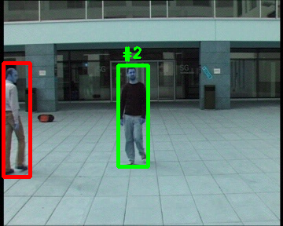

# Object detection and tracking
Object Detection model - pretrained SSD300 [url](https://pytorch.org/hub/nvidia_deeplearningexamples_ssd/) from tensorhub
Tracking Algorytm - SORT [paper](http://arxiv.org/abs/1602.00763) 
 

# Overview

red bboxes - object is not tracked yet, green bboxes - object is tracked by SORT.

## Files
<li><b>check_detections.ipynb</b> - Jupyter Notebook (some R&D)</li>
<li><b>GoTurn_tracker.py</b> - opencv CNN tracker - working awful</li>
<li><b>sort.py</b> - SORT Algo</li>
<li><b>tracker.py</b> - Tracking class</li>
<li><b>.\vids</b> - folder with data</li>
<li><b>.\detector</b> - detection sqripts</li>